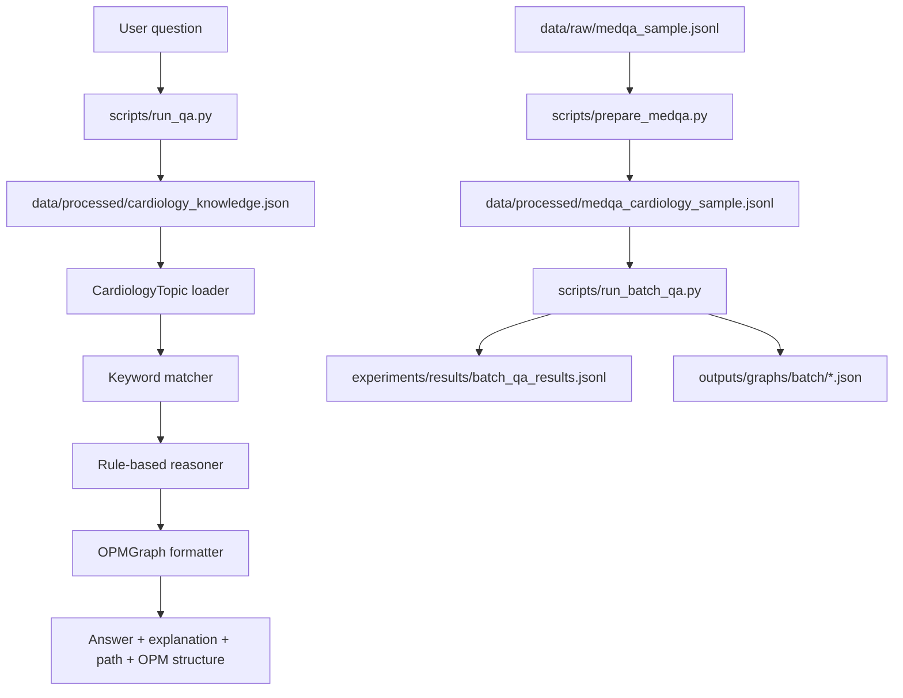
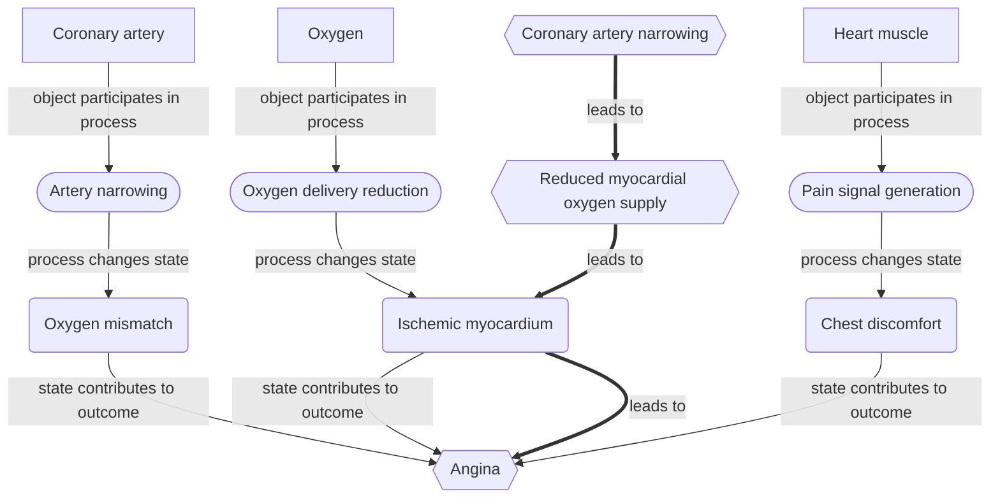

# OPM Medical QA

[](https://github.com/aiqishun/opm-medical-qa/actions/workflows/tests.yml)

**Explainable, OPM-style cardiology question answering for research prototyping.**

`opm-medical-qa` is a small Python research prototype for exploring how
Object-Process Methodology (OPM) can make medical question answering more
transparent. It currently uses a hand-built cardiology knowledge base, simple
keyword matching, and structured OPM output.

> **Non-clinical-use disclaimer:** This repository is for research and education
> only. It is not a medical device, has not been clinically validated, and must
> not be used for diagnosis, treatment, triage, or clinical decision-making. The
> bundled answer text is illustrative prototype content, not medical advice.

## Overview

The prototype returns more than a final answer. For each matched cardiology
topic, it prints:

- an answer
- a natural-language explanation
- a reasoning path
- OPM objects, processes, states, and links

The current system is intentionally dependency-light and beginner-friendly. It
uses only the Python standard library for the core demo and tests.

## Architecture



## Research Goal

The long-term research goal is to investigate whether OPM-style representations
can support explainable medical QA by exposing intermediate reasoning structure.
The current repository focuses on a narrow first step: a clean, runnable
cardiology prototype with mock knowledge and explicit structured output.

## Module Responsibilities

| Area | Files | Responsibility |
| --- | --- | --- |
| CLI demos | `scripts/run_qa.py` | Parse a question, load the KB, run QA, print structured output |
| Batch experiments | `scripts/run_batch_qa.py` | Run the reasoner over a JSONL file and save per-question results plus OPM graphs |
| MedQA placeholder preprocessing | `scripts/prepare_medqa.py` | Filter a JSONL file for cardiology-related examples using broad, strict, or high-confidence modes; writes `matched_terms` and `filter_confidence` for audit |
| Optional LLM filtering | `scripts/llm_filter_medqa.py` | Use a local `OPENAI_API_KEY` to add second-stage cardiology relevance metadata for audit/triage of locally held MedQA-derived candidates |
| Optional LLM route audit | `scripts/llm_route_audit.py` | Use a local `OPENAI_API_KEY` to audit whether OPM `matched_topic` values match the question's primary tested concept |
| MedQA schema inspection | `scripts/inspect_medqa_schema.py` | Summarize a local JSONL file's fields and print a small redacted preview |
| Data helpers | `src/data_io.py` | Read and write JSON/JSONL files with friendly errors |
| Topic model | `src/reasoning/topic.py` | Load and validate cardiology topic records |
| Matching | `src/reasoning/matcher.py` | Score a question against topic keywords and patterns |
| Reasoning | `src/reasoning/reasoner.py` | Select the best topic or return a fallback response |
| OPM formatting | `src/graph/opm_graph.py` | Represent and format objects, processes, states, and links |
| OPM JSON export | `src/graph/exporter.py` | Atomically write an `OPMGraph` to a JSON file |
| Mermaid export | `src/graph/mermaid.py` | Convert an `OPMGraph` to a Mermaid flowchart diagram and write to `.mmd` |
| Output formatting | `src/formatting.py` | Render answer, explanation, reasoning path, and OPM sections |
| Batch summaries | `src/evaluation/summary.py` | Render a Markdown report from a batch QA run |
| Baseline comparison | `src/evaluation/baseline.py`, `scripts/run_baseline_comparison.py` | Keyword-only baseline matcher and Markdown report comparing it against the OPM reasoner |
| Batch audit | `src/evaluation/audit.py`, `scripts/audit_batch_results.py` | Sample matched/fallback rows from a batch results JSONL and write a qualitative Markdown audit (counts, top-N topic table, dominance check, sampled records) |
| Tests | `tests/` | Unit and CLI behavior checks |

## Quick Start

```bash
cd opm-medical-qa
python -m venv .venv
source .venv/bin/activate
pip install -r requirements.txt
python scripts/run_qa.py --question "What causes myocardial infarction?"
```

If your environment uses `python3` instead of `python`:

```bash
python3 scripts/run_qa.py --question "What causes myocardial infarction?"
```

## Demo Output

Command:

```bash
python scripts/run_qa.py --question "What causes myocardial infarction?"
```

Example output:

```text
answer:
Myocardial infarction can be caused by atherosclerosis that leads to coronary artery blockage and reduced blood flow to heart tissue.

explanation:
In this rule-based example, atherosclerosis contributes to plaque build-up in the coronary arteries. This can narrow or block the artery, reduce blood flow, and deprive heart muscle of oxygen, which may lead to myocardial infarction.

reasoning path:
Atherosclerosis -> Coronary artery blockage -> Reduced blood flow -> Myocardial infarction

OPM objects:
- Coronary artery
- Atherosclerotic plaque
- Heart muscle

OPM processes:
- Plaque build-up
- Artery blockage
- Blood flow reduction

OPM states:
- Narrowed artery
- Low oxygen supply
- Injured myocardium

OPM links:
- Coronary artery --[object participates in process]--> Plaque build-up
- Plaque build-up --[process changes state]--> Narrowed artery
- Artery blockage --[process changes state]--> Low oxygen supply
- Blood flow reduction --[process leads to disease outcome]--> Myocardial infarction
```

More demo notes are in [`demos/example_qa.md`](demos/example_qa.md).

## Graph Export

The OPM-style graph for any answered question can be saved as JSON for further
analysis (notebook inspection, comparison runs, downstream tooling). Pass
`--export-graph` to point at a destination file:

```bash
python scripts/run_qa.py \
    --question "What causes myocardial infarction?" \
    --export-graph outputs/graphs/myocardial_infarction.json
```

The CLI still prints the answer, explanation, reasoning path, and OPM sections
exactly as before, then appends a confirmation line:

```text
Graph exported to: outputs/graphs/myocardial_infarction.json
```

The exported JSON has the following shape (fields mirror the knowledge base so
the file can be re-loaded into an `OPMGraph`):

```json
{
  "objects": ["Coronary artery", "Atherosclerotic plaque", "Heart muscle"],
  "processes": ["Plaque build-up", "Artery blockage", "Blood flow reduction"],
  "states": ["Narrowed artery", "Low oxygen supply", "Injured myocardium"],
  "links": [
    {
      "source": "Coronary artery",
      "relationship": "object participates in process",
      "target": "Plaque build-up"
    }
  ]
}
```

Parent directories are created automatically and writes are atomic (the file
is staged via a sibling temporary file and renamed into place). Generated graph
files under `outputs/graphs/` are git-ignored.

> Exported graphs are **OPM-style research artifacts** produced by this
> prototype's rule-based reasoner over a small, hand-built knowledge base. They
> are not curated clinical knowledge graphs, are not validated against medical
> literature, and must not be used for clinical decision-making. The export
> format is also not a standard-compliant OPM serialization — it is a compact
> JSON shape chosen for prototype use.

## Mermaid Export

The OPM-style graph can also be exported as a [Mermaid](https://mermaid.js.org/)
flowchart for visual inspection in any Mermaid-compatible viewer (GitHub,
VS Code, Obsidian, etc.). Pass `--export-mermaid` with a `.mmd` destination:

```bash
python scripts/run_qa.py \
    --question "What causes myocardial infarction?" \
    --export-mermaid outputs/graphs/myocardial_infarction.mmd
```

The CLI appends a confirmation line and the file is valid Mermaid:

```text
Mermaid diagram exported to: outputs/graphs/myocardial_infarction.mmd
```

Example `.mmd` output for the myocardial-infarction topic:

```
flowchart TD
    obj_coronary_artery["Coronary artery"]
    obj_atherosclerotic_plaque["Atherosclerotic plaque"]
    obj_heart_muscle["Heart muscle"]
    proc_plaque_build_up(["Plaque build-up"])
    proc_artery_blockage(["Artery blockage"])
    proc_blood_flow_reduction(["Blood flow reduction"])
    state_narrowed_artery("Narrowed artery")
    state_low_oxygen_supply("Low oxygen supply")
    state_injured_myocardium("Injured myocardium")
    out_myocardial_infarction{{"Myocardial infarction"}}
    step_atherosclerosis{{"Atherosclerosis"}}
    step_coronary_artery_blockage{{"Coronary artery blockage"}}
    step_reduced_blood_flow{{"Reduced blood flow"}}
    obj_coronary_artery -->|"object participates in process"| proc_plaque_build_up
    proc_plaque_build_up -->|"process changes state"| state_narrowed_artery
    proc_artery_blockage -->|"process changes state"| state_low_oxygen_supply
    proc_blood_flow_reduction -->|"process leads to disease outcome"| out_myocardial_infarction
    step_atherosclerosis ==>|"leads to"| step_coronary_artery_blockage
    step_coronary_artery_blockage ==>|"leads to"| step_reduced_blood_flow
    step_reduced_blood_flow ==>|"leads to"| out_myocardial_infarction
    step_atherosclerosis -.->|"involves"| obj_atherosclerotic_plaque
    out_myocardial_infarction -.->|"involves"| obj_heart_muscle
    out_myocardial_infarction -.->|"involves"| state_injured_myocardium
```

Node shapes map to OPM element types:

| Shape | Mermaid syntax | OPM element |
| --- | --- | --- |
| Rectangle | `["label"]` | Object |
| Stadium | `(["label"])` | Process |
| Rounded rectangle | `("label")` | State |
| Hexagon | `{{"label"}}` | Terminal outcome (link endpoint not in O/P/S) or reasoning-path step |

Edge styles convey the kind of relationship:

| Arrow | Meaning |
| --- | --- |
| `-->` | OPM link from the knowledge base |
| `==>` | Reasoning-path spine (`leads to`) — connects upstream cause to final outcome |
| `-.->` | `involves` — wires an otherwise-isolated OPM element into the spine |

The reasoning chain is reflected as a connected `==>` spine, terminal outcomes
are explicitly defined, and isolated OPM elements are attached to the most
relevant reasoning step (best-step matching uses substring containment, then
content-word overlap, then a 5-character common-prefix fuzzy match, with a
fallback to the final step). All shapes and arrow styles render in standard
GitHub-flavored Mermaid.

Both `--export-graph` and `--export-mermaid` can be used together in a single
invocation. Parent directories are created automatically.

### Batch Mermaid export

Pass `--mermaid-dir` to `run_batch_qa.py` to write one `.mmd` file per matched
question alongside the JSON graphs:

```bash
python scripts/run_batch_qa.py \
    --input data/processed/medqa_cardiology_sample.jsonl \
    --output experiments/results/batch_qa_results.jsonl \
    --graphs-dir outputs/graphs/batch/ \
    --mermaid-dir outputs/graphs/batch/
```

Each matched result row gains a `mermaid_path` field pointing to the generated
`.mmd` file (fallback rows have `mermaid_path: null`). When `--mermaid-dir` is
omitted the field is not present in the output at all, so existing pipelines
that do not request Mermaid output are unaffected.

The script prints a confirmation line when diagrams are written:

```text
Exported Mermaid diagrams to: outputs/graphs/batch
```

## Example Outputs

The snippets below come from a real run of this prototype against the bundled
synthetic sample. They are reproduced verbatim from files in this repository so
the documentation stays accurate.

> **Reminder:** every output here was produced by the rule-based reasoner over
> a small, hand-built knowledge base and a synthetic JSONL sample. This is a
> research prototype, **not** a full MedQA evaluation, and the artifacts are
> not validated medical knowledge. Do **not** use any of this for diagnosis,
> triage, or clinical decision-making.

### Single-question CLI run

Command:

```bash
python scripts/run_qa.py --question "What causes angina?"
```

Output:

```text
answer:
Angina is commonly caused by reduced oxygen supply to heart muscle, often due to narrowed coronary arteries.

explanation:
In this rule-based example, coronary artery narrowing limits blood flow during increased demand. The resulting oxygen mismatch in the heart muscle produces ischemia, which manifests as chest discomfort known as angina.

reasoning path:
Coronary artery narrowing -> Reduced myocardial oxygen supply -> Ischemic myocardium -> Angina

OPM objects:
- Coronary artery
- Heart muscle
- Oxygen

OPM processes:
- Artery narrowing
- Oxygen delivery reduction
- Pain signal generation

OPM states:
- Oxygen mismatch
- Ischemic myocardium
- Chest discomfort

OPM links:
- Coronary artery --[object participates in process]--> Artery narrowing
- Oxygen --[object participates in process]--> Oxygen delivery reduction
- Heart muscle --[object participates in process]--> Pain signal generation
- Artery narrowing --[process changes state]--> Oxygen mismatch
- Oxygen delivery reduction --[process changes state]--> Ischemic myocardium
- Pain signal generation --[process changes state]--> Chest discomfort
- Oxygen mismatch --[state contributes to outcome]--> Angina
- Ischemic myocardium --[state contributes to outcome]--> Angina
- Chest discomfort --[state contributes to outcome]--> Angina
```

### JSON graph (excerpt)

The OPM graph for the same angina topic, exported by the batch run to
[`outputs/graphs/batch/angina-001.json`](outputs/graphs/batch/angina-001.json):

```json
{
  "objects": ["Coronary artery", "Heart muscle", "Oxygen"],
  "processes": [
    "Artery narrowing",
    "Oxygen delivery reduction",
    "Pain signal generation"
  ],
  "states": [
    "Oxygen mismatch",
    "Ischemic myocardium",
    "Chest discomfort"
  ],
  "links": [
    {
      "source": "Coronary artery",
      "relationship": "object participates in process",
      "target": "Artery narrowing"
    },
    {
      "source": "Oxygen delivery reduction",
      "relationship": "process changes state",
      "target": "Ischemic myocardium"
    },
    {
      "source": "Ischemic myocardium",
      "relationship": "state contributes to outcome",
      "target": "Angina"
    }
  ]
}
```

The full file contains all 9 links (3 object→process, 3 process→state, 3
state→outcome). The shape mirrors the knowledge base so it can be re-loaded
into an `OPMGraph`.

### Mermaid graph

The same angina run also produces
[`outputs/graphs/batch_mermaid/angina-001.mmd`](outputs/graphs/batch_mermaid/angina-001.mmd).
GitHub renders the block below as an actual diagram:



Notice that the reasoning-path spine (`==>` arrows) reuses the existing
`state_ischemic_myocardium` node rather than duplicating it — the path step
"Ischemic myocardium" exactly matches the OPM state of the same name.

### Batch summary (excerpt)

The full report lives at
[`experiments/results/batch_summary.md`](experiments/results/batch_summary.md);
the excerpt below shows the headline counts and topic frequencies from the
bundled synthetic sample run:

```markdown
# OPM Medical QA — Batch Summary

> Prototype run on a small synthetic sample. This is **not** a full MedQA
> evaluation and reports no medical performance metrics. Generated graphs are
> research artifacts, not clinical knowledge.

## Counts

| Metric | Value |
| --- | ---: |
| Total input records | 16 |
| Questions processed | 16 |
| Skipped (missing question) | 0 |
| Matched | 16 |
| Fallback | 0 |
| Match rate | 100.0% |
| Graph files generated | 16 |

## Matched topic frequency

| Topic | Count |
| --- | ---: |
| atrial fibrillation | 2 |
| hypertension | 2 |
| myocardial infarction | 2 |
| angina | 1 |
| arrhythmia | 1 |
| atherosclerosis | 1 |
| cardiac arrest | 1 |
| cardiomyopathy | 1 |
| coronary artery disease | 1 |
| heart failure | 1 |
| myocarditis | 1 |
| pericarditis | 1 |
| valvular heart disease | 1 |
```

After the audit-driven topic expansion, the bundled synthetic cardiology sample
is fully covered by the prototype knowledge base. Earlier fallback examples
about valve-related care and cardiac rehabilitation now route to broader
research-prototype topics; this is still only a prototype match, not a clinical
correctness claim.

## Knowledge Base

The current hand-built cardiology knowledge base is:

```text
data/processed/cardiology_knowledge.json
```

It includes 21 prototype topics: myocardial infarction, hypertension, heart
failure, angina, arrhythmia, atherosclerosis, coronary artery disease, cardiac
arrest, valvular heart disease, cardiomyopathy, myocarditis, pericarditis,
atrial fibrillation, infective endocarditis, aortic stenosis, mitral
regurgitation, mitral valve prolapse, patent ductus arteriosus, tetralogy of
Fallot, coarctation of the aorta, and pulmonary embolism.
Each topic uses the same schema (`name`, `question_patterns`, `keywords`,
`answer`, `explanation`, `reasoning_path`, `opm_objects`, `opm_processes`,
`opm_states`, `opm_links`) and is structured so that every OPM element
participates in at least one link, the link chain runs from object → process →
state → outcome, and the reasoning path runs from an upstream cause/mechanism
to the disease outcome in 3–5 simplified, non-clinical-decision steps.

## Dataset Status

The full MedQA dataset is **not included** in this repository.

This repository only contains a small, hand-written synthetic JSONL sample for
exercising the preprocessing, batch QA, and summary report pipelines end to
end:

```text
data/raw/medqa_sample.jsonl
```

### Synthetic sample coverage

The sample contains 19 synthetic, MedQA-style records — every question, option,
and explanation was authored for this prototype and **does not** come from the
real MedQA dataset. The split is designed to exercise each stage of the
pipeline:

| Bucket | Count | Purpose |
| --- | ---: | --- |
| Supported topics (matched in batch QA) | 14 | One question per knowledge-base topic, with hypertension and myocardial infarction covered twice to exercise topic-frequency counts |
| Cardiology-adjacent fallbacks | 2 | Pass the keyword preprocessing filter but intentionally fall outside the prototype knowledge base (post-valve-replacement anticoagulation, cardiac rehabilitation) |
| Non-cardiology controls | 3 | Endocrine, dermatology, gastroenterology — used to confirm the preprocessing filter excludes them |

Running `scripts/prepare_medqa.py` on the raw file therefore yields **16**
cardiology-related records. Running `scripts/run_batch_qa.py` over those 16
then produces 16 prototype matches and 16 OPM graph JSON files.

### Local real-MedQA preparation

If you have legitimate local access to the real MedQA dataset, keep it outside
git history. A convenient local path is:

```text
data/raw/medqa_full.jsonl
```

Files under `data/raw/` are ignored by default, except for the tiny synthetic
sample that is intentionally tracked for tests. Do not commit real MedQA data or
processed derivatives from it.

Before filtering a real JSONL file, inspect its shape:

```bash
python scripts/inspect_medqa_schema.py --input data/raw/medqa_full.jsonl
```

The inspector reports record counts, observed top-level fields, coverage for
`question`, `options`, `answer`, and `answer_idx`, and a small redacted preview
of the first records. It truncates long text by default so full medical contents
are not printed into the terminal.

To change the number of previewed records:

```bash
python scripts/inspect_medqa_schema.py \
    --input data/raw/medqa_full.jsonl \
    --max-preview 3
```

Run the placeholder cardiology filter with:

```bash
python scripts/prepare_medqa.py
```

It writes:

```text
data/processed/medqa_cardiology_sample.jsonl
```

Future users with access to the real MedQA dataset should place their JSONL file
under `data/raw/` and pass it explicitly:

```bash
python scripts/prepare_medqa.py --input data/raw/your_medqa_file.jsonl
```

The default filter mode is `broad` for backward compatibility. Broad mode is
useful for the bundled synthetic sample, but it can over-select real records
when generic terms appear in vital signs or past history. `strict` reduces
generic vital-sign triggers and is a better first pass for real-data inspection:

```bash
python scripts/prepare_medqa.py \
    --input data/raw/medqa_full.jsonl \
    --output data/processed/medqa_cardiology_strict.jsonl \
    --filter-mode strict
```

For a more conservative candidate set, use `high_confidence`:

```bash
python scripts/prepare_medqa.py \
    --input data/raw/medqa_full.jsonl \
    --output data/processed/medqa_cardiology_high_confidence.jsonl \
    --filter-mode high_confidence
```

High-confidence mode prioritizes disease/topic terms such as `myocardial
infarction`, `heart failure`, `angina`, `coronary artery disease`,
`endocarditis`, `myocarditis`, `pericarditis`, `cardiomyopathy`, `atrial
fibrillation`, and `cardiac arrest`. It does **not** allow generic terms such as
`ECG`, `EKG`, `murmur`, `blood pressure`, `pulse`, or `heart rate` to select a
record by themselves. `ECG`/`EKG` must appear with context such as `ST
elevation`, `ventricular tachycardia`, `QT prolongation`, or `absent P waves`.
`murmur` must appear with context such as `aortic stenosis`, `mitral
regurgitation`, `valve`, `cyanosis`, `congenital heart disease`, `PDA`, `VSD`,
or `tetralogy of Fallot`.

Every filtered output row includes `matched_terms` and `filter_confidence` so
sampled records can be audited later.

### Optional LLM-assisted cardiology filtering

Keyword filtering can still over-select records where cardiology terms appear
only in past medical history or incidental context. For local audit/triage, an
optional second-stage OpenAI classifier can add structured relevance metadata:

```bash
python scripts/llm_filter_medqa.py \
    --input data/processed/medqa_cardiology_real_high_confidence.jsonl \
    --output data/processed/medqa_cardiology_llm_filtered.jsonl \
    --relevant-output data/processed/medqa_cardiology_llm_relevant.jsonl \
    --summary experiments/results/llm_filter_summary.md \
    --model gpt-4o-mini \
    --limit 50 \
    --dry-run
```

Use `--dry-run` first to print the prompt and a small preview without calling
the API. To run the classifier, set a local API key and omit `--dry-run`:

```bash
export OPENAI_API_KEY=...
python scripts/llm_filter_medqa.py \
    --input data/processed/medqa_cardiology_real_high_confidence.jsonl \
    --output data/processed/medqa_cardiology_llm_filtered.jsonl \
    --relevant-output data/processed/medqa_cardiology_llm_relevant.jsonl \
    --summary experiments/results/llm_filter_summary.md \
    --model gpt-4o-mini \
    --limit 50
```

Each output row preserves the input record and adds:

- `llm_is_cardiology_relevant`
- `llm_primary_topic`
- `llm_confidence`
- `llm_is_incidental_history_only`
- `llm_reason`
- `llm_model`

This layer is optional, uses structured model output when calling the OpenAI
Responses API, retries one failed or malformed response once, and records
per-row error metadata when a classification cannot be obtained.

When `--relevant-output` is provided, the script also writes a second JSONL
containing only rows where `llm_is_cardiology_relevant` is `true` and
`llm_is_incidental_history_only` is `false`. The Markdown summary records the
relevant-only output path and the number of rows written there.

> **Important:** LLM-filtered real MedQA-derived outputs are local artifacts
> only. Do not commit them. This script is for dataset audit/triage and topic
> routing review, not medical answer generation, medical accuracy validation,
> or clinical decision support.

### Optional LLM-assisted topic routing audit

After LLM relevance filtering and batch QA, remaining errors may be topic
routing errors rather than broad cardiology-filtering errors. The optional
route-audit script asks an OpenAI model to identify the primary tested concept
and judge whether the current OPM `matched_topic` is acceptable:

```bash
python scripts/llm_route_audit.py \
    --input experiments/results/llm_relevant_batch_qa_results.jsonl \
    --output experiments/results/llm_route_audit_100.jsonl \
    --summary experiments/results/llm_route_audit_summary_100.md \
    --model gpt-5.4-nano \
    --limit 100 \
    --dry-run
```

Use `--dry-run` first to print the prompt and a small preview without calling
the API. A real run requires a local `OPENAI_API_KEY` and omits `--dry-run`.

For each input row, the script sends only `question`, current `matched_topic`,
`matched_terms`, and `answer`. Each output row preserves the input record and
adds:

- `primary_tested_concept`
- `is_current_topic_acceptable`
- `recommended_topic`
- `is_out_of_scope_for_current_kb`
- `error_type`
- `evidence_sentence`
- `short_reason`
- `confidence`
- `route_audit_model`

`error_type` is one of: `past_medical_history_distraction`,
`family_history_distraction`, `vignette_distraction`,
`manifestation_vs_cause`, `generic_downstream_outcome`,
`physical_sign_recognition_failure`, `anatomy_laterality_failure`,
`temporal_state_transition_failure`, `medication_management_focus`,
`correct_or_acceptable`, or `other`.

The Markdown summary includes counts for acceptable/unacceptable current
topics, out-of-scope recommended topics, failures/skips, and error-type
frequencies.

> **Important:** Route-audit outputs generated from real MedQA-derived rows
> are local artifacts only. Do not commit them. This audit is a qualitative
> routing review aid, not medical answer generation, medical accuracy
> validation, or a benchmark result.

No full MedQA evaluation is included or claimed.

## Batch Experiments

`scripts/run_batch_qa.py` runs the existing rule-based reasoner over every
question in a JSONL file and saves a structured result row per question, plus
one OPM graph JSON per matched question.

```bash
python scripts/run_batch_qa.py \
    --input data/processed/medqa_cardiology_sample.jsonl \
    --output experiments/results/batch_qa_results.jsonl \
    --graphs-dir outputs/graphs/batch/
```

All three flags default to those paths, so the bundled synthetic sample can be
processed with just:

```bash
python scripts/run_batch_qa.py
```

The script prints a short summary and exits non-zero on missing input, invalid
JSONL, or a missing knowledge base:

```text
Read 2 records from: data/processed/medqa_cardiology_sample.jsonl
Matched: 2
Fallback: 0
Skipped (missing question): 0
Wrote results to: experiments/results/batch_qa_results.jsonl
Exported graphs to: outputs/graphs/batch
```

Each line of the output JSONL has this shape:

```json
{
  "id": "case-001",
  "question": "What causes myocardial infarction?",
  "matched_topic": "myocardial infarction",
  "match_score": 12,
  "matched_terms": ["myocardial infarction", "coronary"],
  "filter_confidence": "high_confidence",
  "answer": "...",
  "explanation": "...",
  "reasoning_path": ["Atherosclerosis", "Coronary artery blockage", "Reduced blood flow", "Myocardial infarction"],
  "graph_path": "outputs/graphs/batch/case-001.json",
  "status": "matched"
}
```

Behavior notes:

- `id` is preserved when the input record has one and used as the graph
  filename stem (sanitized to `[A-Za-z0-9_-]`). When absent, the filename
  falls back to `q{index:04d}.json`.
- Records without a string `question` field are skipped and counted in the
  summary rather than aborting the run.
- Unmatched questions still produce an output row, but `matched_topic` and
  `graph_path` are `null` and `status` is `"fallback"`.
- `match_score` is the transparent rule-based topic score. `matched_terms` and
  `filter_confidence` are included when the input row came from
  `prepare_medqa.py`; they record the preprocessing terms and mode that selected
  the row.
- The same non-clinical-use disclaimer applies to all generated artifacts.

### Markdown summary report

Pass `--summary` to also generate a human-readable Markdown report alongside
the JSONL results:

```bash
python scripts/run_batch_qa.py \
    --input data/processed/medqa_cardiology_sample.jsonl \
    --output experiments/results/batch_qa_results.jsonl \
    --graphs-dir outputs/graphs/batch/ \
    --summary experiments/results/batch_summary.md
```

The example summary path is:

```text
experiments/results/batch_summary.md
```

The report is rendered by `src/evaluation/summary.py` and contains:

- the input file, results JSONL, and graphs directory paths
- counts: total input records, questions processed, skipped, matched, fallback
- match rate (percentage of *processed* questions that matched, or `n/a` if
  none were processed)
- number of graph files generated
- a matched-topic frequency table (sorted by count desc, then topic name)
- a list of fallback questions, if any
- a prototype-only disclaimer noting that this is a synthetic-sample run, not
  a full MedQA evaluation, and that exported graphs are research artifacts

The CLI behavior is unchanged when `--summary` is omitted; passing it just
appends a single `Wrote summary report to: …` line to stdout.

## Baseline Comparison

`scripts/run_baseline_comparison.py` runs a deliberately weak keyword-only
baseline alongside the OPM reasoner over the same JSONL sample and reports how
they differ. The baseline (`src/evaluation/baseline.py`) only checks whether a
topic's name or any of its keywords appears as a lowercase substring of the
question — no scoring weights, no content-token overlap, no fuzzy matching. It
returns just a topic name or a fallback; it produces **no** reasoning path,
OPM graph, or natural-language answer.

Run the comparison with:

```bash
python scripts/run_baseline_comparison.py \
    --input data/processed/medqa_cardiology_sample.jsonl \
    --output experiments/results/baseline_comparison.jsonl \
    --summary experiments/results/baseline_comparison_summary.md
```

All flags default to those paths plus the bundled knowledge base, so the
synthetic sample can be processed with just:

```bash
python scripts/run_baseline_comparison.py
```

The script always writes both the per-question JSONL **and** the Markdown
summary, and prints a short stdout report:

```text
Read 16 records from: data/processed/medqa_cardiology_sample.jsonl
Skipped (missing question): 0
Baseline matched / fallback: 14 / 2
OPM QA matched / fallback:   16 / 0
OPM reasoning paths produced: 16
OPM graphs produced:          16
Wrote results to: experiments/results/baseline_comparison.jsonl
Wrote summary report to: experiments/results/baseline_comparison_summary.md
```

Each row of the per-question JSONL has this shape:

```json
{
  "id": "mi-001",
  "question": "...",
  "baseline_matched_topic": "angina",
  "baseline_status": "matched",
  "opm_matched_topic": "myocardial infarction",
  "opm_status": "matched",
  "opm_has_reasoning_path": true,
  "opm_has_graph": true
}
```

The Markdown summary
([`experiments/results/baseline_comparison_summary.md`](experiments/results/baseline_comparison_summary.md))
contains:

- the input and results paths,
- a counts table with: total input records, questions processed, skipped,
  baseline matched / fallback, OPM matched / fallback, OPM reasoning paths
  produced, OPM graphs produced,
- a per-question table showing both matchers' chosen topics and whether the
  OPM reasoner produced a reasoning path and a graph,
- a notes section reminding the reader that "matched" only means a topic was
  returned (not that it is clinically correct) and that the baseline can both
  miss and pick the wrong topic.

> **Important:** this is a prototype-level comparison on a small synthetic
> sample. It makes **no** medical accuracy claims, demonstrates **no**
> superiority on the real MedQA dataset, and the baseline is intentionally
> weak. The numbers are useful only for prototype-level introspection, not for
> any clinical or benchmark conclusion.

## Batch Results Audit

`scripts/audit_batch_results.py` is a **qualitative** audit layer over the
JSONL written by `scripts/run_batch_qa.py`. It is intended for spot-checking
larger runs — for example, a batch over a local MedQA-derived cardiology
subset — where a high match rate may simply reflect broad keyword/topic
matching rather than clinical correctness.

The script:

- counts matched / fallback rows and the matched-topic frequency,
- shows the top 10 most-frequent matched topics and the full topic table,
- raises a ⚠ warning when any single topic accounts for more than **40%** of
  matched cases (configurable in `src/evaluation/audit.py`),
- summarizes `filter_confidence` labels when they are present,
- random-samples up to `--sample-size` records from each of the matched and
  fallback buckets (deterministic via `--seed`), and
- writes a Markdown audit report with the question, matched topic, status,
  preprocessing `matched_terms` when available, truncated answer, and graph
  path for every sampled record.

Run it on a local batch results file (defaults shown):

```bash
python scripts/audit_batch_results.py \
    --input experiments/results/real_medqa_batch_qa_results.jsonl \
    --output experiments/results/real_medqa_audit.md \
    --sample-size 30 \
    --seed 42
```

Stdout reports a short summary plus any topic-dominance warning, e.g.:

```text
Read 5617 records from: experiments/results/real_medqa_batch_qa_results.jsonl
Matched: 5554
Fallback: 63
Sampled matched / fallback: 30 / 30
⚠ Topic dominance: 'coronary artery disease' = 57.1% of matched records
Wrote audit report to: experiments/results/real_medqa_audit.md
```

> **Important — local outputs only.** Audit reports generated against a real
> MedQA-derived batch contain question text and answers from your local
> dataset. **Do not commit these files** (they sit under `experiments/` and
> `outputs/`, which are git-ignored for derived artifacts). The audit is a
> **qualitative, manual** inspection aid — it is **not** an accuracy
> evaluation, makes **no** medical accuracy claims, and a high match rate
> in the audit is **not** evidence of clinical correctness or of MedQA
> performance. Use the sampled rows to read questions and answers by hand
> before drawing any conclusions.

## Manual Evaluation Export

`scripts/export_manual_eval_sample.py` creates a small, deterministic random
sample from a batch QA results JSONL for human annotation. It writes both an
annotation-ready JSONL file and a Markdown checklist.

```bash
python scripts/export_manual_eval_sample.py \
    --input experiments/results/real_medqa_high_confidence_batch_qa_results.jsonl \
    --output-jsonl experiments/manual_eval/high_confidence_sample_100.jsonl \
    --output-md experiments/manual_eval/high_confidence_sample_100.md \
    --sample-size 100 \
    --seed 42
```

The JSONL includes nullable manual annotation fields:

- `manual_is_cardiology_relevant`
- `manual_topic_correct`
- `manual_expected_topic`
- `manual_notes`

The Markdown file provides checkboxes and blank fields for qualitative review.
This workflow is for manual assessment of topic relevance and routing behavior;
it is **not** an automatic accuracy metric, does **not** claim medical
correctness, and is **not** a full MedQA evaluation. Outputs under
`experiments/manual_eval/` are git-ignored because they may contain local
MedQA-derived content.

## Tests

Run the test suite from the project root:

```bash
python3 -m pytest
```

Tests also run automatically in GitHub Actions on every push and pull request
using Python 3.11.

Current local status:

```text
Ran 283 tests
OK
```

The tests cover JSON/JSONL helpers, topic loading, keyword matching, reasoning
fallbacks, OPM formatting, OPM JSON export (including the `--export-graph` CLI
flag), Mermaid diagram conversion and export (including the `--export-mermaid`
and `--mermaid-dir` CLI flags), the batch experiment script (happy path,
fallbacks, missing/blank questions, filename rules, error reporting, and the
`--summary` Markdown report including the input-path-aware "synthetic" /
"local MedQA-derived" / "local input" sample-label disclaimer), the
keyword-only baseline matcher and the `run_baseline_comparison.py` script
(per-question row shape, count aggregations, divergence between baseline and
OPM, missing input/KB error reporting), the qualitative batch-audit module
and the `audit_batch_results.py` script (sampling determinism, dominance
warning above 40%, friendly empty-input rendering, error reporting), manual
evaluation sample export, CLI output, the placeholder MedQA preprocessing
script, and the local MedQA schema inspection script.

## Roadmap

- Expand the cardiology knowledge base with more carefully curated examples
- Add richer OPM link types and graph validation
- Connect extracted evidence passages to reasoning-path steps
- Improve matching while keeping the prototype interpretable
- Add reproducible experiment scripts under `experiments/`
- Define evaluation metrics for answer quality, path faithfulness, and
  explanation usefulness
- Document limitations and failure cases more systematically

## Citation

If you use this repository in academic work, please cite it using the placeholder
below until a formal publication or archived release is available.

```bibtex
@misc{opm_medical_qa,
  title        = {OPM Medical QA: An Explainable Medical Question Answering Prototype for Cardiology},
  author       = {Your Name},
  year         = {2026},
  howpublished = {\url{https://github.com/your-username/opm-medical-qa}},
  note         = {Research prototype}
}
```
