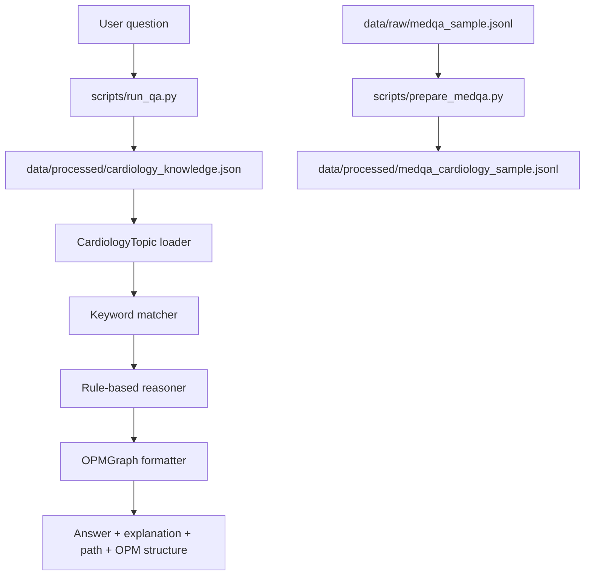

# OPM Medical QA

**Explainable, OPM-style cardiology question answering for research prototyping.**

`opm-medical-qa` is a small Python research prototype for exploring how
Object-Process Methodology (OPM) can make medical question answering more
transparent. It currently uses a hand-built cardiology knowledge base, simple
keyword matching, and structured OPM output.

> **Non-clinical-use disclaimer:** This repository is for research and education
> only. It is not a medical device, has not been clinically validated, and must
> not be used for diagnosis, treatment, triage, or clinical decision-making. The
> bundled answer text is illustrative prototype content, not medical advice.

## Overview

The prototype returns more than a final answer. For each matched cardiology
topic, it prints:

- an answer
- a natural-language explanation
- a reasoning path
- OPM objects, processes, states, and links

The current system is intentionally dependency-light and beginner-friendly. It
uses only the Python standard library for the core demo and tests.

## Architecture



## Research Goal

The long-term research goal is to investigate whether OPM-style representations
can support explainable medical QA by exposing intermediate reasoning structure.
The current repository focuses on a narrow first step: a clean, runnable
cardiology prototype with mock knowledge and explicit structured output.

## Module Responsibilities

| Area | Files | Responsibility |
| --- | --- | --- |
| CLI demos | `scripts/run_qa.py` | Parse a question, load the KB, run QA, print structured output |
| MedQA placeholder preprocessing | `scripts/prepare_medqa.py` | Filter a JSONL file for cardiology-related examples using simple keywords |
| Data helpers | `src/data_io.py` | Read and write JSON/JSONL files with friendly errors |
| Topic model | `src/reasoning/topic.py` | Load and validate cardiology topic records |
| Matching | `src/reasoning/matcher.py` | Score a question against topic keywords and patterns |
| Reasoning | `src/reasoning/reasoner.py` | Select the best topic or return a fallback response |
| OPM formatting | `src/graph/opm_graph.py` | Represent and format objects, processes, states, and links |
| OPM JSON export | `src/graph/exporter.py` | Atomically write an `OPMGraph` to a JSON file |
| Output formatting | `src/formatting.py` | Render answer, explanation, reasoning path, and OPM sections |
| Tests | `tests/` | Unit and CLI behavior checks |

## Quick Start

```bash
cd opm-medical-qa
python -m venv .venv
source .venv/bin/activate
pip install -r requirements.txt
python scripts/run_qa.py --question "What causes myocardial infarction?"
```

If your environment uses `python3` instead of `python`:

```bash
python3 scripts/run_qa.py --question "What causes myocardial infarction?"
```

## Demo Output

Command:

```bash
python scripts/run_qa.py --question "What causes myocardial infarction?"
```

Example output:

```text
answer:
Myocardial infarction can be caused by atherosclerosis that leads to coronary artery blockage and reduced blood flow to heart tissue.

explanation:
In this rule-based example, atherosclerosis contributes to plaque build-up in the coronary arteries. This can narrow or block the artery, reduce blood flow, and deprive heart muscle of oxygen, which may lead to myocardial infarction.

reasoning path:
Atherosclerosis -> Coronary artery blockage -> Reduced blood flow -> Myocardial infarction

OPM objects:
- Coronary artery
- Atherosclerotic plaque
- Heart muscle

OPM processes:
- Plaque build-up
- Artery blockage
- Blood flow reduction

OPM states:
- Narrowed artery
- Low oxygen supply
- Injured myocardium

OPM links:
- Coronary artery --[object participates in process]--> Plaque build-up
- Plaque build-up --[process changes state]--> Narrowed artery
- Artery blockage --[process changes state]--> Low oxygen supply
- Blood flow reduction --[process leads to disease outcome]--> Myocardial infarction
```

More demo notes are in [`demos/example_qa.md`](demos/example_qa.md).

## Graph Export

The OPM-style graph for any answered question can be saved as JSON for further
analysis (notebook inspection, comparison runs, downstream tooling). Pass
`--export-graph` to point at a destination file:

```bash
python scripts/run_qa.py \
    --question "What causes myocardial infarction?" \
    --export-graph outputs/graphs/myocardial_infarction.json
```

The CLI still prints the answer, explanation, reasoning path, and OPM sections
exactly as before, then appends a confirmation line:

```text
Graph exported to: outputs/graphs/myocardial_infarction.json
```

The exported JSON has the following shape (fields mirror the knowledge base so
the file can be re-loaded into an `OPMGraph`):

```json
{
  "objects": ["Coronary artery", "Atherosclerotic plaque", "Heart muscle"],
  "processes": ["Plaque build-up", "Artery blockage", "Blood flow reduction"],
  "states": ["Narrowed artery", "Low oxygen supply", "Injured myocardium"],
  "links": [
    {
      "source": "Coronary artery",
      "relationship": "object participates in process",
      "target": "Plaque build-up"
    }
  ]
}
```

Parent directories are created automatically and writes are atomic (the file
is staged via a sibling temporary file and renamed into place). Generated graph
files under `outputs/graphs/` are git-ignored.

> Exported graphs are **OPM-style research artifacts** produced by this
> prototype's rule-based reasoner over a small, hand-built knowledge base. They
> are not curated clinical knowledge graphs, are not validated against medical
> literature, and must not be used for clinical decision-making. The export
> format is also not a standard-compliant OPM serialization — it is a compact
> JSON shape chosen for prototype use.

## Knowledge Base

The current hand-built cardiology knowledge base is:

```text
data/processed/cardiology_knowledge.json
```

It includes prototype topics for myocardial infarction, hypertension, heart
failure, angina, arrhythmia, atherosclerosis, coronary artery disease, cardiac
arrest, valvular heart disease, and cardiomyopathy. Each topic includes question
patterns, keywords, an answer, an explanation, a reasoning path, and OPM
objects/processes/states/links.

## Dataset Status

The full MedQA dataset is **not included** in this repository.

This repository only contains a tiny synthetic JSONL sample for testing the
preprocessing script:

```text
data/raw/medqa_sample.jsonl
```

Run the placeholder cardiology filter with:

```bash
python scripts/prepare_medqa.py
```

It writes:

```text
data/processed/medqa_cardiology_sample.jsonl
```

Future users with access to the real MedQA dataset should place their JSONL file
under `data/raw/` and pass it explicitly:

```bash
python scripts/prepare_medqa.py --input data/raw/your_medqa_file.jsonl
```

No full MedQA evaluation is included or claimed.

## Tests

Run the test suite from the project root:

```bash
python -m unittest discover -t . -s tests
```

Current local status:

```text
Ran 69 tests
OK
```

The tests cover JSON/JSONL helpers, topic loading, keyword matching, reasoning
fallbacks, OPM formatting, OPM JSON export (including the `--export-graph` CLI
flag), CLI output, and the placeholder MedQA preprocessing script.

## Roadmap

- Expand the cardiology knowledge base with more carefully curated examples
- Add richer OPM link types and graph validation
- Connect extracted evidence passages to reasoning-path steps
- Improve matching while keeping the prototype interpretable
- Add reproducible experiment scripts under `experiments/`
- Define evaluation metrics for answer quality, path faithfulness, and
  explanation usefulness
- Document limitations and failure cases more systematically

## Citation

If you use this repository in academic work, please cite it using the placeholder
below until a formal publication or archived release is available.

```bibtex
@misc{opm_medical_qa,
  title        = {OPM Medical QA: An Explainable Medical Question Answering Prototype for Cardiology},
  author       = {Your Name},
  year         = {2026},
  howpublished = {\url{https://github.com/your-username/opm-medical-qa}},
  note         = {Research prototype}
}
```
